<div align="center">


# 🎰 Q‑Lottery Game

### Real quantum randomness you can **watch collapse** into your lucky numbers.

[](https://share.streamlit.io/denny-hwang/q-lottery-game/main/main.py)
[](https://github.com/Denny-Hwang/q-lottery-game/actions/workflows/ci.yml)
[](runtime.txt)
[](https://streamlit.io)
[](https://qiskit.org)
[](https://plotly.com)
[](LICENSE)

**[🚀 Live demo](https://share.streamlit.io/denny-hwang/q-lottery-game/main/main.py)** · **[🔬 Quantum Lab](#-quantum-lab--the-star-of-the-show)** · **[🧪 The science](#-the-science-in-90-seconds)** · **[🌍 Games](#-supported-lotteries)**

</div>

---

> 🎲 Most "random" generators just run an algorithm with a hidden seed.
> **This one measures a qubit.**
> Spin a **Bloch sphere**, press a button to make the superposition **collapse**,
> and watch the bits turn into your lottery numbers — one quantum coin flip at a time.

---

## ✨ Why this is actually fun

| | |
|---|---|
| 🔬 **Quantum Lab** | A guided, click-through journey from a single qubit to a finished lottery ball — built to *teach* while you play. |
| 🌀 **Interactive 3D Bloch spheres** | Drag to rotate. See each qubit move from the north pole to the equator the instant you add a gate. |
| 💥 **Press-to-collapse** | Hit **🎲 Measure** and watch every vector snap to a pole — blue for `0`, red for `1`. Randomness, happening in front of you. |
| 🔗 **Feel entanglement** | Turn on birthday mode and *see* a Bloch vector physically **shrink** ( \|r\| < 1 ) when it gets entangled. |
| 🔢 **Watch the decode** | Bits → place values → a decimal → range check (**rejection sampling**) → a colored ball. The whole pipeline, visualized. |
| 🌍 **6 real lotteries + Custom** | Korea, USA, India, Japan, France, and your own range. |
| 🇰🇷 / 🇺🇸 **Bilingual** | Full Korean & English, one click. |

---

## 🔬 Quantum Lab — the star of the show

Open **🔬 Quantum Lab** from the sidebar and step through *exactly* how a random number is born:

```mermaid
flowchart LR
    A["🌐 |0⟩<br/>north pole"] -->|H gate| B["🌀 superposition<br/>50 / 50"]
    B -->|T gate| P["🔄 phase<br/>spin the equator"]
    P -->|CRY · birthday| C["🔗 entangle<br/>vector shrinks"]
    C -->|🎲 measure| D["💥 collapse<br/>0 or 1"]
    D --> E["🔢 bits<br/>1·0·1·0·1·1"]
    E -->|binary → decimal| F["🔟 decimal<br/>43"]
    F -->|range check| G["🎱 your<br/>number"]
    classDef q fill:#EEF2FF,stroke:#6366F1,color:#1E1B4B;
    class A,B,P,C,D,E,F,G q;
```



Every stage pairs a **live Bloch sphere** with a plain-language explanation:

| Stage | What you *see* | What you *learn* |
|---|---|---|
| ① **Initialize** | All arrows point to the north pole (\|0⟩). | Qubits always start at 0. |
| ② **Superposition** | A Hadamard tips each arrow to the equator. | The **quantum coin flip** — 50/50 true randomness. |
| ③ **Phase** *(toggle)* | A `T` gate spins the arrow around the equator… | …yet `P(0)/P(1)` **don't budge** — the intuition behind **interference**. |
| ④ **Entangle** *(toggle)* | `CRY` links your birthday; targeted vectors **shrink**. | "Look at only part of an entangled system and it goes fuzzy." |
| ⑤ **Measure** | Press 🎲 — arrows snap to the poles (blue 0 / red 1). | **Collapse**: superposition becomes a definite bit. |
| ⑥ **Decode** | Bits add up by place value, get range-checked, become a ball. | How raw quantum bits become *your* number. |

> 🎛️ Change the qubit count, flip on **phase** and **entanglement**, and re-measure as many times as you like. It's a sandbox.

---

## 🧪 The science in 90 seconds

There are two ways to make "random" numbers:

- 🎲 **TRNG (true)** — measure an unpredictable physical phenomenon. *Genuinely* unpredictable.
- 🤖 **PRNG (pseudo)** — an algorithm expands a hidden seed. Looks random, but it's fully determined.

This app is a **TRNG**: it builds a quantum circuit with **[IBM Qiskit](https://qiskit.org/)**, puts qubits into **[superposition](https://en.wikipedia.org/wiki/Quantum_superposition)** with the **[Hadamard gate](https://en.wikipedia.org/wiki/Hadamard_transform)**, and reads out a real measurement. Entanglement is added with the **[CRY gate](https://docs.quantum.ibm.com/)**. Numbers run on the local `AerSimulator` (an IBM-flavored quantum simulator), so there's no account or wait time.

📐 Curious about the design? See **[`docs/quantum-visualization-improvement-plan.md`](docs/quantum-visualization-improvement-plan.md)**.

---

## 🎛️ Two generation modes

| Mode | What it does |
|---|---|
| **A) Simple Q‑RNG** | Pure Hadamard superposition — every bit is a fair quantum coin flip. |
| **B) Birthday‑entangled Q‑RNG** | Two ancilla qubits encode your month & day as `CRY` rotation angles, entangling with two *distinct* result qubits. Your birthday gently nudges the distribution — **without** collapsing it. |

---

## 🌍 Supported lotteries

| Game | Rule |
|---|---|
| 🇰🇷 **[Lotto (Korea)](https://dhlottery.co.kr/)** | Pick 6 from 1–45 · *compares your picks against the latest official draw!* |
| 🇺🇸 **[Powerball (USA)](https://www.powerball.com/)** | 5 white balls (1–69) + 1 Powerball (1–26) |
| 🇮🇳 **[Lotto India](https://www.lotto.in/)** | 6 from 1–50 + 1 Joker ball (1–5) |
| 🇯🇵 **[Lotto7 (Japan)](https://en.lottolyzer.com/how-to-play/japan/lotto-7)** | Pick 7 from 1–37 |
| 🇫🇷 **[French Loto](http://france-lottery.com/)** | 5 from 1–49 + 1 Lucky number (1–10) |
| 🛠️ **Custom** | Any count, any range — your rules |

Plus: 🖼️ **download a shareable PNG ticket**, 📜 a per‑session history, and 📋 copy‑friendly result text.

---

## ⚡ Quickstart

```bash
git clone https://github.com/Denny-Hwang/q-lottery-game.git
cd q-lottery-game
pip install -r requirements.txt
streamlit run main.py
```

Then open the sidebar and dive into **🔬 Quantum Lab**. Python 3.11 recommended (see `runtime.txt`).

---

## ✅ Tests

```bash
pip install pytest ruff
ruff check . --select=E,F,W --ignore=E501
pytest -q
```

96 tests cover the quantum-state math (Bloch vectors, collapse, decoding), the Plotly figures, the RNG range guarantees, the Korean‑draw comparator, and the PNG export.

---

## 🧩 How it's built

Math and rendering are kept separate so the physics stays fast and testable:

| Module | Role |
|---|---|
| `q_function.py` | Q‑RNG circuits + measurement (Hadamard / birthday‑entangled) |
| `q_state.py` | Pure `Statevector` → Bloch‑vector data layer (no UI) |
| `bloch_viz.py` | Interactive **Plotly** Bloch spheres + probability bars |
| `lab.py` | The **Quantum Lab** stepper page |
| `main.py` · `ui.py` · `i18n.py` | Streamlit app shell, ball rendering, ko/en strings |

---

## 🤝 Contributing

Want to add another country's lottery? It's three small steps — see [`add_new_game/registration_form.md`](add_new_game/registration_form.md) and open a PR. 🎉

---

## ⚠️ Just for fun

Quantum randomness is statistically *more uniform* than a PRNG — but it **does not improve your odds of winning**. Play responsibly and enjoy the physics. 🙂

---

## 📄 License

[MIT](LICENSE) · Built with [Streamlit](https://streamlit.io) + [IBM Qiskit](https://qiskit.org) + [Plotly](https://plotly.com)
