# 양자 시각화 개선 계획 (Quantum Visualization Improvement Plan)

> **목표 한 줄 요약**: "양자 회로 그림 + 번호"에서 멈추지 말고, **블로흐 구(Bloch sphere)에서
> 각 비트가 어떻게 태어나고 → 측정으로 collapse 되고 → 2진수가 되고 → 십진수가 되고 →
> 내가 고른 로또 번호로 변하는지**를 단계별로 직접 만져보며 배우는 인터랙티브 학습 경험으로 확장한다.

| 항목 | 값 |
|---|---|
| 작성일 | 2026-06-05 |
| 작업 브랜치 | `claude/sleepy-allen-7YqxT` |
| 상태 | **Phase 1–7 구현 완료** — Quantum Lab 페이지 추가, 96개 테스트 통과 |
| 관련 파일 | `q_function.py`, `main.py`, `ui.py`, `intro_doc.py`, `i18n.py` |

---

## 목차

1. [배경과 동기](#1-배경과-동기)
2. [현재 구조 분석](#2-현재-구조-분석)
3. [핵심 학습 내러티브](#3-핵심-학습-내러티브-the-story)
4. [타겟 사용자 경험(UX)](#4-타겟-사용자-경험-ux)
5. [기술 아키텍처](#5-기술-아키텍처)
6. [단계별 구현 로드맵](#6-단계별-구현-로드맵)
7. [시각화 설계 디테일](#7-시각화-설계-디테일)
8. [리스크와 완화책](#8-리스크와-완화책)
9. [테스트 전략](#9-테스트-전략)
10. [미해결 질문 (사용자 확인 필요)](#10-미해결-질문-사용자-확인-필요)
11. [진행 로그 (Progress Log)](#11-진행-로그-progress-log)

---

## 1. 배경과 동기

### 현재 사용자가 보는 것
- `Show details` 토글을 켜면 **정적인 양자 회로 그림**(`circuit_drawer`, matplotlib)과
  **이진 → 십진 변환 표**(pandas DataFrame)가 나온다.
- 결과는 **색깔 공**으로 애니메이션되어 표시된다.

### 무엇이 아쉬운가
- 회로 그림은 한 장의 정적 이미지라 **"왜 이게 난수인가"**가 직관적으로 와닿지 않는다.
- **블로흐 구**, **중첩(superposition)**, **위상(phase)**, **측정 시 collapse**, **얽힘(entanglement)**
  같은 핵심 개념이 *글*로만 설명되고 *시각적으로* 체험되지 않는다.
- 비트열 → 십진수 → 로또 번호로 이어지는 **파이프라인의 인과관계**가 표 한 줄로 압축되어 있다.
- 사용자가 직접 **단계를 넘기거나, 구를 돌려보거나, 측정 버튼을 눌러 collapse를 일으키는**
  상호작용이 전혀 없다.

### 이번 개선이 가르치려는 4가지 개념 (사용자 요청)
1. **블로흐 구에서의 위상 변화** — H 게이트로 적도로 이동, 위상 게이트(S/T/Z)로 적도 위 회전
2. **측정 시 collapse** — 중첩 상태가 0 또는 1로 "확정"되는 순간
3. **회로 구성(circuit composition)** — 게이트가 하나씩 쌓이며 상태가 변하는 과정
4. **얽힘의 역할(entanglement)** — 생일 모드의 CRY 게이트가 만드는 상관관계와,
   "부분만 보면 상태가 흐려진다(블로흐 벡터 수축)"는 직관

---

## 2. 현재 구조 분석

| 파일 | 역할 | 이번 작업과의 관계 |
|---|---|---|
| `q_function.py` | Qiskit + AerSimulator 기반 Q-RNG. `_build_simple_circuit`(H만), `_build_birthday_circuit`(H + CRY 얽힘), `_measure`(shots=1 측정), `q_rng_lotto`(rejection sampling) | **상태벡터/블로흐 데이터 레이어**를 여기에 또는 신규 모듈에 추가 |
| `main.py` | Streamlit 라우팅, `generate_numbers_detailed`, `_render_game_form`(`show_details` 토글로 회로/표 노출) | **새 "양자 실험실" 라우트**와 기존 details 강화 지점 |
| `ui.py` | `render_balls`(HTML/CSS 공 애니메이션), 공유 텍스트 | 공 "드롭" 애니메이션, collapse → 공 연결 |
| `intro_doc.py` | About 페이지 카피(ko/en), 예시 회로 2개 | 실험실로 가는 진입 동선, 개념 카피 |
| `i18n.py` | ko/en 번역 딕셔너리 | 신규 문자열 전부 등록 |
| `games.py` | 게임별 설정(범위, 팔레트, 보너스 볼) | 변경 없음(범위/비트수 재사용) |
| `card_export.py` | 결과 PNG 티켓 | 변경 없음(필요 시 교육 카드 추가 검토) |

### 현재 회로 두 종류 (재사용할 자산)
```text
단순 Q-RNG:      q ── H ──╫─  (각 비트 50:50 중첩 후 측정)
생일 얽힘 Q-RNG:  q ── H ───────●──╫─   (CRY로 메인 큐비트를 살짝 회전)
ancilla(월/일) ─ H ──────CRY┘
```
- 비트 수는 `bits_needed(upper_bound)`로 결정 (예: 1~45 → 6비트).
- 범위를 벗어나면 `q_rng_lotto`의 **rejection sampling**으로 다시 뽑는다 → 이 "버려지는 표본"도
  좋은 교육 소재(아래 Phase 5).

---

## 3. 핵심 학습 내러티브 (The Story)

사용자가 따라갈 단 하나의 일관된 스토리라인:

```mermaid
flowchart LR
    A["|0⟩ 큐비트 n개<br/>(북극)"] -->|"H 게이트"| B["중첩 상태<br/>(적도 위 벡터)"]
    B -->|"위상 게이트 S/T/Z<br/>(선택·학습용)"| P["위상 회전<br/>(적도에서 도는 벡터)"]
    P -->|"CRY 게이트<br/>(생일 모드)"| C["얽힘<br/>(블로흐 벡터 수축 |r|<1)"]
    C -->|"측정 (Measure)"| D["Collapse<br/>(0 또는 1로 확정)"]
    D --> E["비트열 1·0·1·0·1·1"]
    E -->|"2진 → 10진"| F["십진수 43"]
    F -->|"범위검사<br/>rejection sampling"| G["로또 번호 43"]
    G --> H["색깔 공 🎱"]
```



각 단계에서 **명시적으로 가르칠 메시지**:

| 단계 | 시각적 사건 | 한 줄 학습 메시지 |
|---|---|---|
| 0. 초기화 | 모든 구가 북극(|0⟩) | "큐비트는 0에서 출발합니다." |
| 1. 중첩 | 벡터가 북극 → 적도로 이동, P(0)=P(1)=50% | "H 게이트는 양자 동전을 공중에 띄웁니다." |
| 2. 위상 | 적도 위에서 벡터가 회전(같은 확률, 다른 위상) | "위상은 측정 확률을 바꾸지 않지만 간섭에 쓰입니다." |
| 3. 얽힘 | 생일 모드: 한 구의 벡터 길이가 1보다 짧아짐 | "얽히면 '부분'만 봐선 상태를 알 수 없습니다." |
| 4. 측정 | 벡터가 북극/남극으로 **탁** 붙음(애니메이션) | "측정하는 순간 동전이 바닥에 떨어져 앞/뒤가 정해집니다." |
| 5. 디코딩 | 비트가 자리값(32 16 8 4 2 1)과 함께 더해짐 | "측정된 비트열은 곧 하나의 정수입니다." |
| 6. 범위검사 | 범위 밖이면 빨갛게 버려지고 재추첨 | "로또 범위에 맞을 때까지 다시 뽑습니다(rejection)." |
| 7. 로또 공 | 십진수가 색깔 공으로 변신 | "이렇게 *진짜* 양자 난수가 내 번호가 됩니다." |

---

## 4. 타겟 사용자 경험 (UX)

### 4.1 신규 페이지: "🔬 양자 실험실 / Quantum Lab"
사이드바 메뉴에 항목 추가(About / 각 로또 / Custom 옆). 한 비트 또는 한 게임을
**스텝퍼(stepper)**로 한 단계씩 진행하며 관찰.

```text
┌───────────────────────────────────────────────────────────────┐
│  🔬 양자 실험실                                [비트 수: 3 ▾]   │
│                                                                │
│  [① 초기화] [② 중첩] [③ 위상] [④ 얽힘] [⑤ 측정] [⑥ 디코딩]    │  ← 단계 탭/스텝퍼
│  ───────────●──────────────────────────────────────           │
│                                                                │
│  ┌── 블로흐 구 (큐비트별, 드래그 회전 가능) ──┐  ┌ 설명 ──────┐ │
│  │   q0 ◓    q1 ◓    q2 ◓                  │  │ H 게이트는…│ │
│  └────────────────────────────────────────┘  └────────────┘ │
│                                                                │
│  확률 막대:  q0 |■■■■■□□□□□| P(1)=50%                          │
│  현재 회로:  q0 ─ H ─■─                                         │
│                                                                │
│  [◀ 이전]                      [측정하기 🎲]        [다음 ▶]    │
└───────────────────────────────────────────────────────────────┘
```

핵심 인터랙션:
- **단계 이동**: 이전/다음 버튼 + 직접 탭 클릭(`st.session_state`로 단계 인덱스 관리).
- **블로흐 구 회전/줌**: Plotly 3D(마우스 드래그). 큐비트가 여러 개면 그리드로 배치.
- **측정 버튼**: 누르면 각 구의 벡터가 극(0/1)으로 collapse 되는 **애니메이션** 재생,
  동시에 비트열이 확정.
- **위상 토글**: H 다음에 S/T/Z를 끼워 넣어 적도 위에서 벡터가 도는 모습을 직접 관찰(학습용).
- **얽힘 토글**: 생일(월/일) 입력 시 CRY 추가 → 블로흐 벡터 수축 + 두 큐비트 상관 그래프.

### 4.2 기존 게임 흐름 강화
`_render_game_form`의 `Show details` 토글을 확장:
- 기존: 정적 회로 + 디코딩 표
- 추가(선택): **"이 번호가 만들어진 블로흐 구 보기"** 미니 버전 — 실제로 뽑힌 비트열에 맞춰
  collapse 결과를 보여주고, "실험실에서 더 알아보기" 링크 제공.

### 4.3 About 페이지 연결
`intro_doc.py`의 개념 설명 옆에 "▶ 실험실에서 직접 해보기" CTA 버튼 추가.

---

## 5. 기술 아키텍처

### 5.1 신규/변경 모듈

| 모듈 | 신규/변경 | 책임 |
|---|---|---|
| `q_state.py` | **신규** | 측정 없는 회로를 단계별로 만들고 `Statevector`/블로흐 벡터/확률을 계산하는 **순수 데이터 레이어** (Streamlit/matplotlib 의존 없음 → 테스트 용이) |
| `bloch_viz.py` | **신규** | 블로흐 벡터 → **Plotly 3D Figure**(인터랙티브) + collapse 애니메이션 프레임 |
| `lab.py` | **신규** | "양자 실험실" 페이지 렌더(스텝퍼, 구 그리드, 확률 막대, 회로 하이라이트, 디코딩 파이프라인) |
| `q_function.py` | 변경(소폭) | `_build_*_circuit`을 "측정 분리" 형태로 재사용 가능하게 살짝 리팩터(측정 전 회로를 `q_state`가 빌려 쓰도록) |
| `main.py` | 변경 | 라우팅에 실험실 추가, details 강화 |
| `i18n.py` | 변경 | 신규 문자열(ko/en) |
| `intro_doc.py` | 변경 | 실험실 진입 CTA |
| `requirements.txt` | 변경 | `plotly>=5.20` 추가(아래 §10에서 확정) |

> **설계 원칙**: 무거운 시각화(Plotly/3D)와 순수 양자 계산(Statevector)을 분리한다.
> `q_state.py`는 의존성이 가벼워 CI에서 빠르게 단위 테스트할 수 있고, `bloch_viz.py`/`lab.py`는
> 렌더링만 담당한다(현재 `q_function.py`/`card_export.py`가 계산과 그리기를 나눈 패턴과 동일).

### 5.2 핵심 계산 (`q_state.py`) — 함수 시그니처 초안
```python
from dataclasses import dataclass
from qiskit.quantum_info import Statevector, DensityMatrix, partial_trace, Pauli

Vec3 = tuple[float, float, float]

@dataclass(frozen=True)
class StageState:
    key: str                 # "init" | "superposition" | "phase" | "entangle" | "collapse"
    title_key: str           # i18n 키
    statevector: Statevector
    bloch: list[Vec3]        # 큐비트별 블로흐 좌표 (얽히면 |r|<1)
    p0p1: list[tuple[float, float]]  # 큐비트별 (P0, P1)
    gate_added: str | None   # 이 단계에서 추가된 게이트 라벨(회로 하이라이트용)

def bloch_vector(state: Statevector | DensityMatrix, qubit: int) -> Vec3:
    """단일 큐비트 환산 밀도행렬에서 ⟨X⟩,⟨Y⟩,⟨Z⟩ 를 뽑는다."""
    rho = partial_trace(DensityMatrix(state), [q for q in range(state.num_qubits) if q != qubit])
    x = rho.expectation_value(Pauli("X")).real
    y = rho.expectation_value(Pauli("Y")).real
    z = rho.expectation_value(Pauli("Z")).real
    return (x, y, z)

def circuit_stages(bits: int, *, birthday: tuple[int, int] | None = None,
                   phase_demo: bool = False) -> list[StageState]:
    """초기화→중첩→(위상)→(얽힘) 단계별 StageState 리스트(측정 전)."""

def collapse_to_poles(measured_bits: str) -> list[Vec3]:
    """측정된 비트열에 맞춰 각 큐비트를 북극(0)/남극(1)으로 보낸 좌표."""
```

> 참고: 측정된 비트열은 기존 `q_function._measure`(shots=1)를 그대로 사용해 **실제 양자 측정 결과**와
> 일치시킨다. 확률은 `Statevector.probabilities`로 계산.

### 5.3 인터랙티브 렌더 (`bloch_viz.py`)
```python
import plotly.graph_objects as go

def bloch_figure(vec: Vec3, *, label: str = "", collapsed: bool = False) -> go.Figure:
    """반투명 구 + 적도/축 + 상태 벡터 화살표. collapsed=True면 극에 붙은 빨강/파랑 강조."""

def bloch_grid(vectors: list[Vec3], labels: list[str]) -> go.Figure:
    """여러 큐비트를 한 화면(subplot)에 배치."""

def collapse_animation(before: Vec3, after: Vec3) -> go.Figure:
    """Plotly frames + play 버튼으로 적도→극 collapse 모션."""
```

### 5.4 상태 관리(Streamlit)
- 단계 인덱스, 비트 수, 위상/얽힘 토글, 측정 결과를 `st.session_state`에 저장.
- "측정하기" 클릭 전까지는 측정 결과 비표시 → **collapse의 인과(클릭=측정)**를 체감시킨다.
- 단계 전환 시 `st.rerun()` 사용(현재 코드의 언어 전환 패턴과 동일).

---

## 6. 단계별 구현 로드맵

> 각 Phase는 독립 커밋/PR 단위. **Phase 0(본 문서)**가 머지된 뒤 1→7 순서로 진행.
> 각 단계 끝에 `pytest -q` + `ruff check` 통과를 완료 기준으로 둔다.

### Phase 0 — 계획 & 로그 *(이번 작업)*
- [x] 코드베이스 분석
- [x] 본 개선 계획 문서 작성 (`docs/quantum-visualization-improvement-plan.md`)
- [ ] 사용자 리뷰 및 §10 결정 확정

### Phase 1 — 양자 상태/블로흐 **데이터 레이어** (`q_state.py`)
- `circuit_stages`, `bloch_vector`, `collapse_to_poles`, 확률 계산 구현.
- **단위 테스트**: |0⟩→Z=+1, H 후 X=+1·Z≈0, P0=P1=0.5, 얽힘 시 |r|<1 등 수학 검증.
- 산출물: `q_state.py`, `tests/test_q_state.py`. (시각화/Streamlit 의존 없음 → CI 가볍게)

### Phase 2 — 인터랙티브 **블로흐 구 렌더** (`bloch_viz.py`)
- Plotly 3D 구/축/벡터, 그리드 배치, collapse 애니메이션 프레임.
- `requirements.txt`에 `plotly` 추가, `pylatexenc`처럼 import 스모크 테스트.
- 산출물: `bloch_viz.py`, `tests/test_bloch_viz.py`(Figure 생성/트레이스 개수 검증).

### Phase 3 — **양자 실험실 페이지** 골격 (`lab.py` + 라우팅)
- 사이드바 메뉴 추가, 스텝퍼(이전/다음/탭), 비트 수 선택, 단계별 구+설명+확률 막대+회로.
- i18n 문자열 등록(ko/en).
- 산출물: `lab.py`, `main.py`/`i18n.py` 변경.

### Phase 4 — **측정 collapse** 인터랙션
- "측정하기 🎲" 버튼 → 실제 측정 → collapse 애니메이션 → 비트열 확정 표시.
- 측정 전/후 상태를 명확히 구분(중첩 vs 확정).

### Phase 5 — **비트 → 십진 → 로또 번호** 파이프라인 시각화
- 자리값(32 16 8 4 2 1) 분해 + 합산 애니메이션.
- **rejection sampling 시각화**: 범위 밖 표본을 빨갛게 표시하고 재추첨하는 모습.
- 최종 십진수 → `render_balls`로 공 "드롭" 연결.

### Phase 6 — **얽힘(생일 모드)** 심화
- 생일 입력 시 CRY 추가 → 블로흐 벡터 수축 시각화 + 두 큐비트 상관(결합 확률 히트맵).
- "왜 부분만 보면 흐려지는가"를 환산 밀도행렬로 설명.

### Phase 7 — **기존 게임 통합 + 마감**
- `Show details`에 미니 블로흐/collapse 결과 + 실험실 링크.
- About 페이지 CTA, README 갱신, 전체 i18n 점검, 접근성/모바일 확인.
- 산출물: `main.py`/`intro_doc.py`/`ui.py`/`README.md` 변경.

---

## 7. 시각화 설계 디테일

### 7.1 블로흐 구 구성요소
- 반투명 단위 구 + 적도 원 + X/Y/Z 축 + 극 라벨(|0⟩ 북극, |1⟩ 남극, |+⟩/|−⟩ 적도).
- 상태 벡터: 원점→(x,y,z) 화살표. **길이 = 순수도**(얽히면 < 1).
- 색상: 미측정=보라, 측정 후 0=파랑(북극)·1=빨강(남극).

### 7.2 위상(phase) 데모 — 사용자 요청 핵심
- H 직후 벡터는 **+X(|+⟩)**. 여기에 **S(90°)/T(45°)/Z(180°)** 를 끼우면 적도 위에서 **azimuth가 회전**.
- 학습 포인트 강조: "**위상이 돌아도 P(0)=P(1)=50%는 그대로**" → 측정 확률 막대는 변하지 않음을 나란히 보여줌.
- (심화) H–Z–H = X 처럼 위상+간섭이 측정 결과를 바꾸는 예를 옵션으로.

### 7.3 측정 collapse
- 중첩(적도) → 클릭 → 프레임 애니메이션으로 벡터가 극으로 이동 → 극에 "탁" 고정 + 비트 확정.
- 확률 막대가 "주사위" 역할: P(1)=50%이면 절반 확률로 남극.

### 7.4 얽힘 수축
- 단순 모드: 모든 구의 |r|=1(순수).
- 생일 모드: CRY로 얽힌 큐비트의 환산 밀도행렬 → **|r|<1**(구 안쪽으로 들어간 짧은 벡터).
- 옆에 두 큐비트 결합 확률(00/01/10/11) 막대/히트맵으로 상관관계 노출.

### 7.5 디코딩 파이프라인
```text
측정 비트:   q5 q4 q3 q2 q1 q0  =  1  0  1  0  1  1
자리값:      32 16  8  4  2  1
            ─────────────────────────────────
선택:        32  0  8  0  2  1   →  합 = 43
범위검사:    1 ≤ 43 ≤ 45  ✅  →  로또 번호 43  →  🟡(공)
```
- 비트를 클릭하면 해당 자리값이 합계에 더해지는 인터랙티브(또는 순차 애니메이션).

---

## 8. 리스크와 완화책

| 리스크 | 영향 | 완화책 |
|---|---|---|
| **상태벡터 폭발**(n 큐비트 → 2ⁿ) | 큰 범위(예: Custom 50조)는 50+ 큐비트 → 계산 불가 | 실험실은 **교육용으로 비트 수 상한(예 ≤ 6)**. 실제 게임 생성 경로는 기존 방식 유지(상태벡터 미사용) |
| **신규 의존성(plotly)** | 배포 크기/호환성 | `pylatexenc` 추가 선례 있음. import 스모크 테스트 + 버전 핀. (대안: matplotlib `plot_bloch_multivector` 정적 폴백 — §10) |
| **Streamlit rerun으로 상태 유실** | 단계/측정 결과 리셋 | `st.session_state` 키로 단계·측정·토글 명시 관리, 키 네임스페이스 분리 |
| **애니메이션 성능/모바일** | 느림/끊김 | Plotly frame 수 제한, 구 mesh 해상도 보수적, 모바일에서 그리드 1열 |
| **matplotlib 전역 상태**(현재 Agg) | 혼용 시 충돌 | 블로흐는 Plotly로 분리, 기존 회로 그림은 그대로 |
| **i18n 누락** | 한쪽 언어 깨짐 | 신규 키는 ko/en 동시 추가를 PR 체크리스트에 포함 |

---

## 9. 테스트 전략

- **순수 계산(`q_state.py`)**: 결정론적 단위 테스트
  - |0⟩: Z=+1; H 후: |X|≈1, Z≈0, P0≈P1≈0.5
  - S/T 후: 적도 유지(|Z|≈0), azimuth 변화
  - 얽힘 후: 환산 블로흐 |r| < 1
  - `collapse_to_poles("101")` → 극 좌표 정확성
- **렌더(`bloch_viz.py`)**: Figure 객체 생성·트레이스 개수·데이터 유한성(NaN 없음) 검증(`MPLBACKEND=Agg`/headless Plotly).
- **회귀**: 기존 `q_function`/RNG 동작·범위 보장 테스트 유지(난수 경로 불변).
- CI는 현행 `ruff check . --select=E,F,W --ignore=E501` + `pytest -q` 그대로 사용.

---

## 10. 미해결 질문 (사용자 확인 필요)

> 아래 결정에 따라 Phase 2 이후 구현이 달라지므로, 착수 전 합의 필요.

1. **인터랙티브 라이브러리**: 3D 드래그 가능한 **Plotly 추가**(권장, 더 "재밌음") vs 의존성 0인
   **matplotlib 정적 블로흐**(`plot_bloch_multivector`). → 권장: **Plotly**.
2. **범위**: **신규 "양자 실험실" 페이지 + 기존 details 강화(둘 다)** vs 둘 중 하나만. → 권장: **둘 다**.
3. **진행 방식**: 본 계획 머지 후 **Phase 1부터 순차 PR** vs 한 번에 큰 PR. → 권장: **순차 PR**.
4. **언어 우선순위**: 신규 학습 카피를 ko/en 동시 작성(기존 정책 유지) 확인.

---

## 11. 진행 로그 (Progress Log)

| 날짜 | 작성자 | 내용 |
|---|---|---|
| 2026-06-05 | Claude (claude/sleepy-allen-7YqxT) | 코드베이스 전체 분석 완료. 양자 시각화 개선 계획 v1 수립 및 본 문서 작성. 7단계 로드맵·신규 모듈(`q_state.py`/`bloch_viz.py`/`lab.py`) 설계. Phase 0 산출물로 저장소에 기록. |
| 2026-06-05 | Claude (claude/sleepy-allen-7YqxT) | 사용자 결정 확정(Plotly 3D 채택, Phase 1부터 구현). **Phase 1–7 일괄 구현**: ① `q_state.py`(상태/블로흐 데이터 레이어, 단위테스트 20개) ② `bloch_viz.py`(Plotly 인터랙티브 블로흐 구·확률 막대, 테스트 11개) ③ `lab.py`(🔬 양자 실험실 스텝퍼 페이지: 초기화→중첩→위상→얽힘→측정/collapse→디코딩) ④ `main.py` 라우팅·사이드바·About CTA·details 힌트 ⑤ `i18n.py` ko/en 신규 문자열 ⑥ `requirements.txt`에 plotly 추가 ⑦ README 갱신. 전체 96개 테스트 통과, ruff 통과. |

<!-- 이후 각 Phase 완료 시 이 표에 한 줄씩 append 한다. -->
